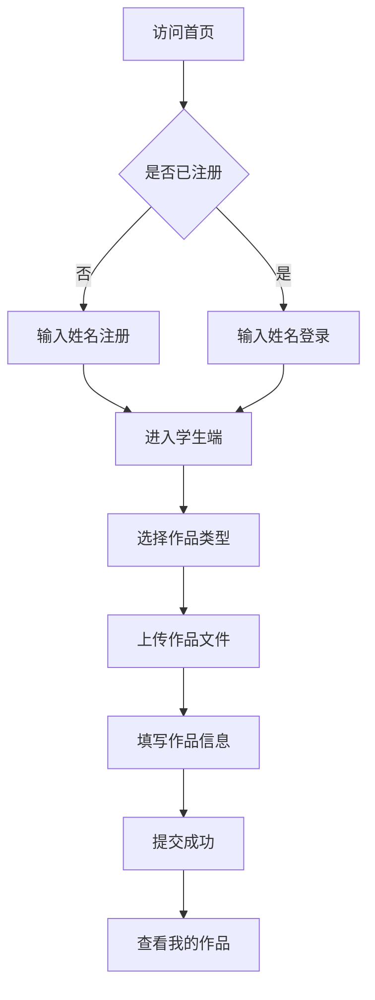
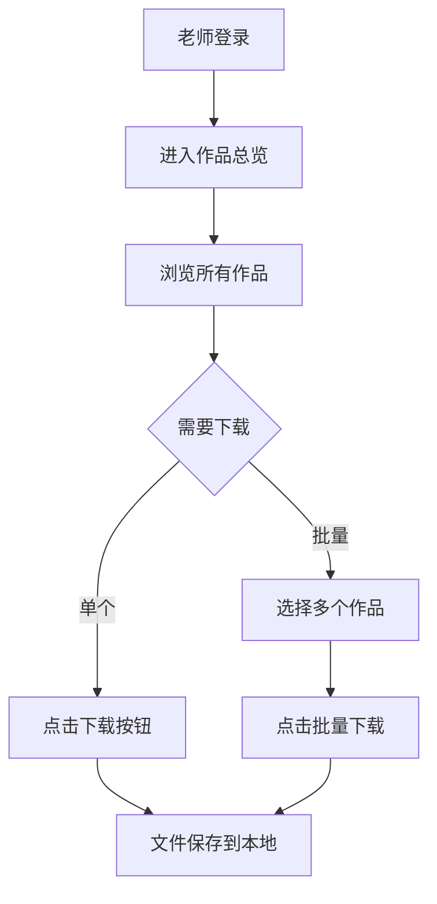

# AI作品收集网站 - 产品需求文档

## 1. 产品概述

一个面向青少年的AI作品收集平台，用于收集和整理学生的AI创作成果。系统支持学生通过姓名注册并提交图片、视频、HTML作品，老师可查看和下载所有作品进行保存。

**核心价值**：
- 简化作品收集流程，提高教学管理效率
- 为AI竞赛和培训提供作品管理支撑
- 支持多种作品格式，兼容性强

## 2. 核心功能

### 2.1 用户角色

| 角色 | 注册方式 | 核心权限 |
|------|----------|----------|
| 学生 | 姓名注册 | 提交作品、查看自己的作品 |
| 老师 | 预设账号登录 | 查看所有作品、下载作品、管理作品 |

### 2.2 功能模块

1. **首页**：平台介绍、登录/注册入口、导航栏
2. **学生端**：
   - 姓名注册/登录
   - 作品提交页面（支持图片、视频、HTML三种格式）
   - 我的作品列表（查看已提交的作品）
3. **老师端**：
   - 作品总览（展示所有学生作品）
   - 作品筛选与搜索
   - 批量下载功能（支持ZIP打包下载）

### 2.3 页面详情

| 页面名称 | 模块名称 | 功能描述 |
|----------|----------|----------|
| 首页 | 欢迎区 | 展示平台名称、口号、快速入口按钮 |
| 首页 | 功能介绍 | 展示三大功能：图片作品、视频作品、HTML作品 |
| 登录页 | 注册表单 | 输入姓名即可注册 |
| 登录页 | 登录表单 | 输入姓名即可登录（老师使用预设账号） |
| 学生端 | 作品提交 | 选择作品类型、上传文件、填写作品名称和描述 |
| 学生端 | 我的作品 | 展示个人提交的作品列表，支持预览和删除 |
| 老师端 | 作品总览 | 卡片展示所有作品，显示学生姓名、作品类型、提交时间 |
| 老师端 | 批量下载 | 选择多个作品后打包下载 |

## 3. 核心流程

### 3.1 学生注册与作品提交流程

### 3.2 老师作品管理流程

## 4. 用户界面设计

### 4.1 设计风格

- **主题**：科技感与活力感结合，适合青少年群体
- **主色调**：蓝色系（#2563EB 为主色，#3B82F6 为辅助色）
- **强调色**：橙色（#F97316）用于重要按钮和提示
- **背景色**：浅灰白（#F8FAFC）为主，深色区域使用（#1E293B）
- **字体**：思源黑体（Noto Sans SC）作为中文字体，现代无衬线英文字体
- **布局**：卡片式布局，清晰的视觉层级
- **图标**：使用Lucide图标库，线性风格
- **动画**：平滑的过渡动画，悬停效果增强交互感

### 4.2 页面设计概览

| 页面名称 | 模块名称 | UI元素和样式 |
|----------|----------|--------------|
| 首页 | 欢迎区 | 大标题渐变背景，带光晕效果，蓝色主调 |
| 首页 | 功能卡片 | 白色卡片悬浮阴影，三栏布局 |
| 登录页 | 表单区 | 居中卡片，圆角输入框，渐变按钮 |
| 学生端 | 作品提交 | 拖拽上传区，虚线边框，图标提示 |
| 学生端 | 作品列表 | 网格布局，缩略图预览，卡片样式 |
| 老师端 | 作品总览 | 筛选栏+卡片网格，支持勾选多选 |
| 老师端 | 下载栏 | 底部悬浮栏，显示已选数量和下载按钮 |

### 4.3 响应式设计

- **桌面端**：1200px以上，三栏或四栏网格布局
- **平板端**：768px-1200px，两栏布局
- **移动端**：768px以下，单栏布局，底部导航栏

## 5. 作品格式支持

### 5.1 图片作品
- 格式：JPG、PNG、GIF、WebP
- 最大尺寸：10MB
- 预览：点击放大查看

### 5.2 视频作品
- 格式：MP4、WebM
- 最大尺寸：50MB
- 预览：内嵌视频播放器

### 5.3 HTML作品
- 格式：HTML文件 + 关联资源（CSS、JS、图片等）
- 最大尺寸：20MB（压缩包）
- 预览：新窗口打开或iframe内嵌预览

## 6. 数据存储

使用浏览器本地存储（LocalStorage）模拟后端：
- 用户数据：学生姓名、注册时间、角色标识
- 作品数据：作品类型、文件信息、关联学生、提交时间
- 文件存储：图片转Base64存储，视频和HTML使用对象URL引用

**注意**：由于使用本地存储，数据仅保存在当前浏览器，建议老师定期导出备份。
