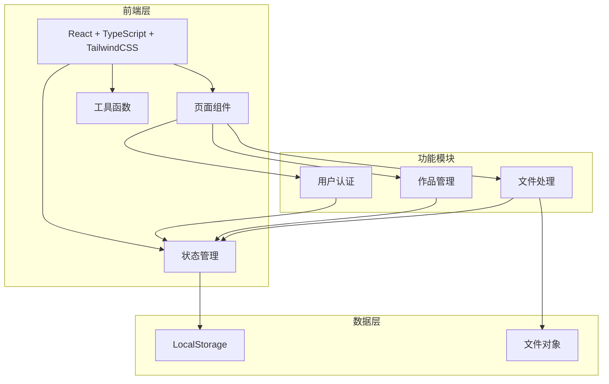

# AI作品收集网站 - 技术架构文档

## 1. 架构设计

### 1.1 系统架构图



### 1.2 技术选型

- **前端框架**：React 18 + TypeScript
- **构建工具**：Vite
- **样式方案**：Tailwind CSS 3
- **状态管理**：Zustand
- **图标库**：Lucide React
- **文件处理**：原生 File API + JSZip（打包下载）
- **存储方案**：浏览器 LocalStorage

**选型理由**：
1. React + TypeScript 提供类型安全和组件化开发
2. Vite 提供快速的开发体验
3. Tailwind CSS 提供高效的样式开发
4. Zustand 轻量级状态管理，适合小型项目
5. 本地存储方案无需后端服务器，部署简单

## 2. 页面路由

| 路由路径 | 页面名称 | 访问权限 |
|----------|----------|----------|
| / | 首页 | 公开 |
| /login | 登录/注册页 | 公开 |
| /student | 学生控制台 | 学生登录 |
| /student/submit | 提交作品页 | 学生登录 |
| /student/works | 我的作品页 | 学生登录 |
| /teacher | 老师控制台 | 老师登录 |
| /teacher/works | 作品总览页 | 老师登录 |

## 3. 数据模型

### 3.1 用户数据模型

```typescript
interface User {
  id: string;           // 唯一标识符
  name: string;         // 姓名
  role: 'student' | 'teacher';  // 角色
  createdAt: number;    // 注册时间戳
}
```

### 3.2 作品数据模型

```typescript
interface Artwork {
  id: string;                    // 唯一标识符
  studentId: string;              // 学生ID
  studentName: string;            // 学生姓名
  title: string;                  // 作品名称
  description: string;            // 作品描述
  type: 'image' | 'video' | 'html';  // 作品类型
  fileName: string;                // 文件名
  fileData: string;                // 文件数据（Base64或URL）
  fileSize: number;                // 文件大小（字节）
  mimeType: string;                // MIME类型
  createdAt: number;               // 提交时间
  thumbnail?: string;              // 缩略图（用于图片预览）
}
```

### 3.3 LocalStorage 数据结构

| 键名 | 数据类型 | 说明 |
|------|----------|------|
| users | User[] | 用户列表 |
| artworks | Artwork[] | 作品列表 |
| currentUser | User \| null | 当前登录用户 |
| teacherPassword | string | 老师登录密码（简化版预设） |

## 4. 核心功能实现

### 4.1 用户认证模块

**注册流程**：
1. 输入姓名
2. 生成唯一ID
3. 判断角色（学生直接注册，老师需验证密码）
4. 存储到LocalStorage
5. 设置当前用户

**登录流程**：
1. 输入姓名
2. 验证用户存在
3. 加载用户信息
4. 设置当前用户

### 4.2 作品上传模块

**图片上传**：
1. 监听文件选择或拖拽
2. 验证文件类型和大小
3. 转换为Base64
4. 生成缩略图
5. 存储到作品数据

**视频上传**：
1. 验证文件类型和大小
2. 创建对象URL
3. 存储URL引用

**HTML上传**：
1. 验证文件为HTML或ZIP
2. 如果是ZIP，解压提取HTML文件
3. 存储文件内容

### 4.3 作品管理模块

**列表展示**：
- 按时间倒序排列
- 支持按学生姓名筛选
- 支持按作品类型筛选
- 搜索功能（按作品名称）

**下载功能**：
- 单个下载：直接下载文件
- 批量下载：使用JSZip打包
  1. 收集选中的作品文件
  2. 创建ZIP压缩包
  3. 生成下载链接
  4. 触发下载

## 5. 组件结构

```
src/
├── components/           # 可复用组件
│   ├── Header.tsx       # 顶部导航栏
│   ├── Footer.tsx       # 底部版权信息
│   ├── Card.tsx         # 通用卡片组件
│   ├── Button.tsx       # 按钮组件
│   ├── Input.tsx        # 输入框组件
│   ├── FileUpload.tsx   # 文件上传组件
│   ├── ArtworkCard.tsx  # 作品卡片组件
│   └── Modal.tsx        # 模态框组件
├── pages/               # 页面组件
│   ├── Home.tsx         # 首页
│   ├── Login.tsx        # 登录注册页
│   ├── StudentDashboard.tsx    # 学生控制台
│   ├── SubmitWork.tsx   # 提交作品页
│   ├── MyWorks.tsx      # 我的作品页
│   ├── TeacherDashboard.tsx     # 老师控制台
│   └── WorksOverview.tsx       # 作品总览页
├── stores/              # 状态管理
│   ├── authStore.ts     # 用户认证状态
│   └── artworkStore.ts  # 作品状态
├── utils/               # 工具函数
│   ├── storage.ts       # LocalStorage操作
│   ├── fileHelper.ts    # 文件处理工具
│   └── downloadHelper.ts # 下载工具
├── types/               # TypeScript类型定义
│   └── index.ts         # 类型定义文件
├── App.tsx             # 根组件
└── main.tsx            # 入口文件
```

## 6. UI设计规范

### 6.1 颜色系统

```css
:root {
  /* 主色 */
  --primary-50: #EFF6FF;
  --primary-100: #DBEAFE;
  --primary-500: #3B82F6;
  --primary-600: #2563EB;
  --primary-700: #1D4ED8;
  
  /* 辅助色 */
  --accent: #F97316;
  --accent-hover: #EA580C;
  
  /* 中性色 */
  --gray-50: #F8FAFC;
  --gray-100: #F1F5F9;
  --gray-200: #E2E8F0;
  --gray-300: #CBD5E1;
  --gray-400: #94A3B8;
  --gray-500: #64748B;
  --gray-600: #475569;
  --gray-700: #334155;
  --gray-800: #1E293B;
  --gray-900: #0F172A;
  
  /* 状态色 */
  --success: #10B981;
  --warning: #F59E0B;
  --error: #EF4444;
}
```

### 6.2 字体规范

- **标题**：思源黑体 / Noto Sans SC，Bold/SemiBold
- **正文**：思源黑体 / Noto Sans SC，Regular/Medium
- **字号**：
  - H1: 48px
  - H2: 36px
  - H3: 24px
  - Body: 16px
  - Small: 14px
  - Caption: 12px

### 6.3 间距系统

基于4px网格：
- xs: 4px
- sm: 8px
- md: 16px
- lg: 24px
- xl: 32px
- 2xl: 48px
- 3xl: 64px

### 6.4 圆角与阴影

- **卡片圆角**：12px
- **按钮圆角**：8px
- **输入框圆角**：8px
- **阴影**：
  - sm: 0 1px 2px rgba(0,0,0,0.05)
  - md: 0 4px 6px rgba(0,0,0,0.1)
  - lg: 0 10px 15px rgba(0,0,0,0.1)
  - xl: 0 20px 25px rgba(0,0,0,0.15)

## 7. 浏览器兼容性

- Chrome/Edge: 最新版本
- Firefox: 最新版本
- Safari: 最新版本
- 不支持IE浏览器

## 8. 性能优化

1. **图片优化**：上传时压缩图片，生成缩略图
2. **懒加载**：作品列表使用虚拟滚动（如果作品数量超过100）
3. **代码分割**：按路由动态导入页面组件
4. **缓存策略**：LocalStorage数据在页面加载时缓存到Zustand

## 9. 老师账号配置

**默认老师账号**：
- 姓名：admin
- 密码：admin123

**首次使用**：
系统初始化时自动创建老师账号。
